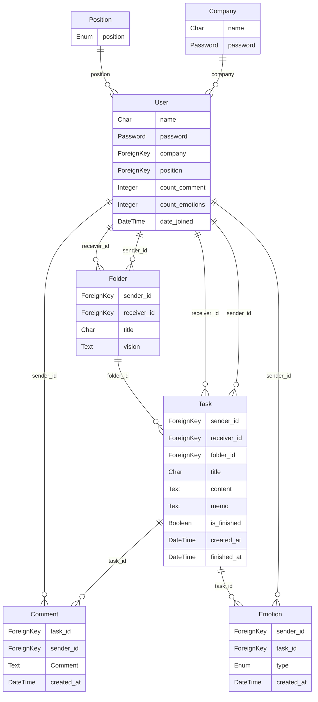

```mermaid
erDiagram
    User ||--o{ Task: "sender_id"
    User ||--o{ Task: "receiver_id"
    Folder ||--o{ Task: "folder_id"

    Company ||--o{ User: "company"

    Position ||--o{ User: "position"

    Task ||--o{ Comment: "task_id"
    User ||--o{ Comment: "sender_id"

    User ||--o{ Folder: "sender_id"
    User ||--o{ Folder: "receiver_id"

    User ||--o{ Emotion: "sender_id"
    Task ||--o{ Emotion: "task_id"

    Company {
        Char name
        Password password
    }

    User {
        Char name
        Password password
        ForeignKey company
        ForeignKey position
        Integer count_comment
        Integer count_emotions
        DateTime date_joined
    }

    Position {
        Enum position
    }

    Folder {
        ForeignKey sender_id
        ForeignKey receiver_id
        Char title
        Text vision
    }

    Task {
        ForeignKey sender_id
        ForeignKey receiver_id
        ForeignKey folder_id
        Char title
        Text content
        Text memo
        Boolean is_finished 
        DateTime created_at
        DateTime finished_at   
    }

    Comment {
        ForeignKey task_id
        ForeignKey sender_id
        Text Comment
        DateTime created_at
    }

    Emotion {
        ForeignKey sender_id
        ForeignKey task_id
        Enum type
        DateTime created_at
    }
```